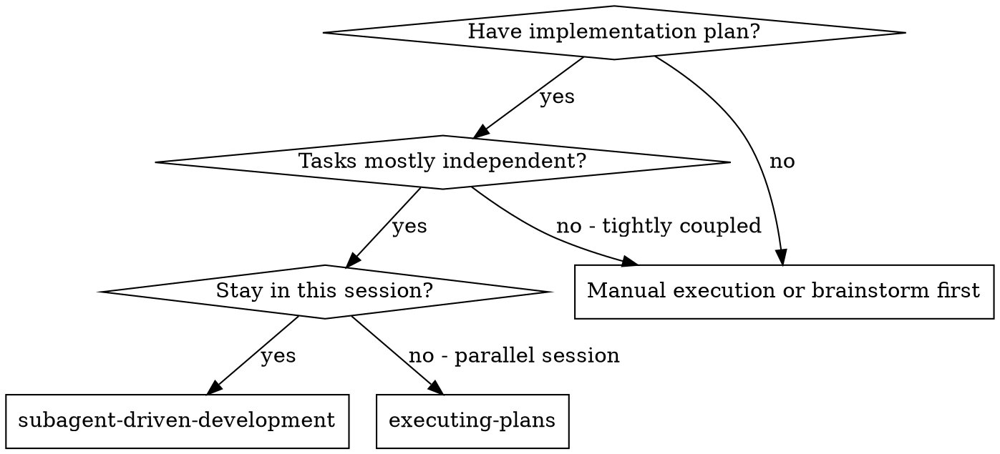
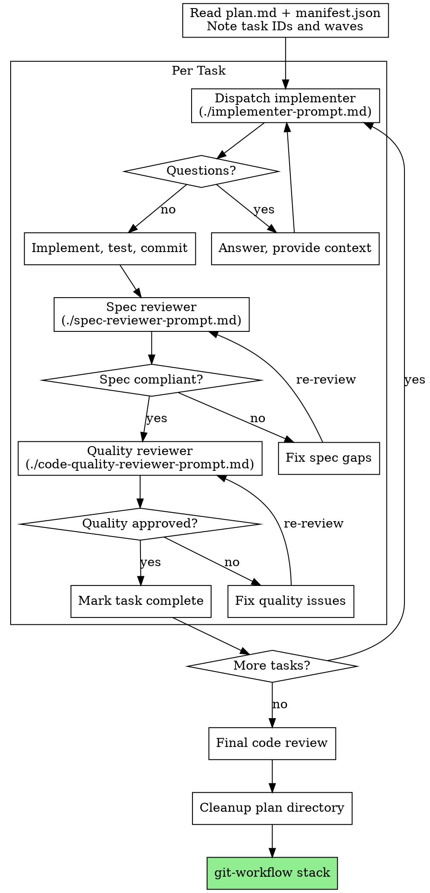

# Subagent-Driven Development — Process Detail

## Decision Tree

## Full Process Flow

## Dispatching Agents

For each task, dispatch the implementer with:
- A 2-3 sentence summary (from the orchestration plan's task table)
- The briefing file path: `.claude/plans/<plan-id>/briefings/task-NN.md`
- The agent reads the full specification from its briefing file

See prompt templates for exact dispatch format.

## At Wave Boundaries

Re-read `manifest.json` from disk to recover task state if context has been compacted. Update task statuses in the manifest as tasks complete.
